# 🤖 AI Agent Factory - Complete Setup Guide

## 🌟 System Overview

The AI Agent Factory is a **fully automated** pipeline that builds custom security-focused local AI agents for businesses. From order placement to delivery, everything is handled by intelligent automation.

### Core Capabilities

- ✅ **Custom Agent DNA**: Select 3 expert traits from 10+ domains
- ✅ **Knowledge Base Integration**: Upload business data/docs for agent training
- ✅ **System Integrations**: Pre-built connectors for Slack, Salesforce, Stripe, etc.
- ✅ **Automated Build Pipeline**: Zero-touch from order → build → test → delivery
- ✅ **Docker Deployment**: Containerized agents ready to deploy
- ✅ **$0 Marketing Spend**: AI-driven sales ops and bot swarms (separate system)

---

## 📁 Project Structure

```
agent_factory/
├── core/
│   ├── agent_dna.py              # Expert trait system & DNA synthesis
│   ├── data_pipeline.py          # Knowledge base creation & vector storage
│   ├── integration_builder.py   # OAuth/API/webhook scaffolding
│   ├── agent_builder.py          # Main build orchestrator
│   └── delivery_workflow.py     # Order → delivery automation
├── api_service.py                # REST API (FastAPI)
├── requirements.txt              # Python dependencies
├── docker-compose.yml            # Service orchestration
├── Dockerfile                    # API container
└── README.md                     # This file
```

---

## 🚀 Quick Start

### Prerequisites

- Python 3.11+
- Docker & Docker Compose
- Anthropic API key

### Installation

```bash
# 1. Clone/download the factory code
cd agent_factory

# 2. Install dependencies
pip install -r requirements.txt

# 3. Set environment variables
export ANTHROPIC_API_KEY="your_api_key_here"

# 4. Start the API service
python api_service.py
```

The API will be available at `http://localhost:8000`

### Docker Deployment

```bash
# Build and run with Docker Compose
docker-compose up --build

# Or run standalone
docker build -t agent-factory .
docker run -p 8000:8000 -e ANTHROPIC_API_KEY=$ANTHROPIC_API_KEY agent-factory
```

---

## 🎯 API Endpoints

### 1. Create Order

**POST** `/orders`

Submit a new agent build order.

```bash
curl -X POST http://localhost:8000/orders \
  -H "Content-Type: application/json" \
  -d '{
    "customer_id": "cust_123",
    "customer_email": "customer@example.com",
    "specifications": {
      "agent_name": "SecureFinOps Assistant",
      "traits": ["financial_analyst", "security_auditor", "operations_optimizer"],
      "custom_context": "Specializes in fintech compliance and secure operations.",
      "data_sources": [
        {
          "type": "text",
          "name": "company_policies",
          "content": "Our security policy requires 2FA for all transactions..."
        }
      ],
      "integrations": ["slack", "salesforce", "stripe"]
    }
  }'
```

**Response:**
```json
{
  "order_id": "ORD-A1B2C3D4",
  "status": "received",
  "message": "Order received and queued for processing",
  "estimated_completion_minutes": 10
}
```

---

### 2. Check Order Status

**GET** `/orders/{order_id}`

Track build progress.

```bash
curl http://localhost:8000/orders/ORD-A1B2C3D4
```

**Response:**
```json
{
  "order_id": "ORD-A1B2C3D4",
  "status": "ready_for_delivery",
  "build_job_id": "job_xyz789",
  "delivery_url": "https://downloads.example.com/packages/delivery_ORD-A1B2C3D4.zip",
  "error_message": null
}
```

**Status Values:**
- `received` - Order validated and queued
- `building` - Agent being constructed
- `testing` - Running automated tests
- `packaging` - Creating deployment package
- `ready_for_delivery` - Download link ready
- `delivered` - Customer has been notified
- `failed` - Build error (see error_message)

---

### 3. List Available Traits

**GET** `/traits`

View all expert traits you can select.

```bash
curl http://localhost:8000/traits
```

**Response:**
```json
{
  "total_traits": 10,
  "traits": {
    "financial_analyst": {
      "name": "Financial Analyst",
      "domain": "finance",
      "core_skills": ["financial modeling", "risk assessment", "market analysis"]
    },
    "security_auditor": {
      "name": "Security Auditor",
      "domain": "security",
      "core_skills": ["vulnerability assessment", "compliance checking", "threat modeling"]
    }
    // ... 8 more traits
  }
}
```

---

### 4. List Available Integrations

**GET** `/integrations`

View all system integrations.

```bash
curl http://localhost:8000/integrations
```

**Response:**
```json
{
  "total_integrations": 9,
  "integrations": {
    "slack": {
      "system_name": "Slack",
      "integration_type": "oauth",
      "required_scopes": ["chat:write", "channels:read"]
    },
    "salesforce": {
      "system_name": "Salesforce",
      "integration_type": "oauth",
      "required_scopes": ["api", "refresh_token"]
    }
    // ... 7 more integrations
  }
}
```

---

### 5. Webhook Endpoint

**POST** `/webhook/order-placed`

For integration with external systems (Stripe, Shopify, etc.)

```bash
curl -X POST http://localhost:8000/webhook/order-placed \
  -H "Content-Type: application/json" \
  -d '{
    "customer_id": "cust_456",
    "customer_email": "webhook@example.com",
    "specifications": {
      "agent_name": "Sales Bot",
      "traits": ["sales_enablement", "customer_support_specialist", "content_strategist"],
      "integrations": ["hubspot"]
    }
  }'
```

---

## 🧬 Expert Traits Library

Customers select **exactly 3 traits** from these domains:

| Trait ID | Name | Domain | Best For |
|----------|------|--------|----------|
| `financial_analyst` | Financial Analyst | Finance | Financial modeling, risk assessment |
| `content_strategist` | Content Strategist | Marketing | SEO, content planning, brand voice |
| `code_reviewer` | Code Reviewer | Engineering | Code quality, security audits |
| `data_scientist` | Data Scientist | Analytics | ML models, statistical analysis |
| `customer_support_specialist` | Customer Support | Support | Ticket resolution, empathetic communication |
| `sales_enablement` | Sales Enablement | Sales | Lead qualification, CRM management |
| `security_auditor` | Security Auditor | Security | Vulnerability assessment, compliance |
| `operations_optimizer` | Operations Optimizer | Operations | Process improvement, automation |
| `legal_advisor` | Legal Advisor | Legal | Contract review, compliance guidance |
| `product_manager` | Product Manager | Product | Roadmap planning, feature prioritization |

---

## 🔌 System Integrations

Pre-built integration scaffolding for:

- **Slack** - Team communication and notifications
- **Salesforce** - CRM and customer data
- **Google Drive** - Document access and storage
- **HubSpot** - Marketing and sales automation
- **Stripe** - Payment processing
- **GitHub** - Code repository access
- **Zendesk** - Customer support ticketing
- **Asana** - Project management
- **Generic Webhooks** - Custom event handling

Each integration includes:
- OAuth flow implementation
- API wrapper functions
- Authentication handling
- Common endpoint methods

---

## 📦 What Gets Delivered

When an order completes, the customer receives:

### 1. Deployment Package
```
delivery_ORD-{order_id}/
├── Dockerfile                    # Container configuration
├── docker-compose.yml            # Service orchestration
├── deployment_manifest.json      # Complete specifications
├── README.md                     # Setup guide
├── dna/
│   └── agent_config.json         # Agent DNA and capabilities
├── knowledge_base/
│   └── knowledge_base.json       # Vector-embedded customer data
└── integrations/
    ├── slack_oauth.py            # Integration implementations
    ├── stripe_oauth.py
    └── integration_manifest.json
```

### 2. Quick Start Guide
```bash
# 1. Extract package
unzip delivery_ORD-ABC123.zip
cd delivery_ORD-ABC123

# 2. Configure environment
export ANTHROPIC_API_KEY="your_key"
export AGENT_ID="agent_xyz"

# 3. Deploy
docker-compose up -d

# 4. Test
curl http://localhost:8000/health
```

### 3. Email Notifications

Customers receive automated emails at:
- Order received
- Build started
- Agent ready (with download link)
- Failure (if any issues)

---

## 🔄 Automated Workflow

```mermaid
graph LR
    A[Order Placed] --> B[Validate Specs]
    B --> C[Create Build Job]
    C --> D[Synthesize DNA]
    D --> E[Ingest Data]
    E --> F[Build Integrations]
    F --> G[Run Tests]
    G --> H[Package Deployment]
    H --> I[Generate Download Link]
    I --> J[Send Email]
    J --> K[Customer Downloads]
```



**Timeline:** 5-10 minutes from order to delivery

---

## 🧪 Testing

### Run Unit Tests
```bash
# Test individual components
python -m pytest core/test_agent_dna.py
python -m pytest core/test_data_pipeline.py
python -m pytest core/test_integration_builder.py
```

### Test Complete Pipeline
```bash
# Full end-to-end test
python core/agent_builder.py
python core/delivery_workflow.py
```

### API Testing
```bash
# Start service
python api_service.py

# In another terminal
curl http://localhost:8000/health
curl http://localhost:8000/traits
curl http://localhost:8000/integrations

# Submit test order
curl -X POST http://localhost:8000/orders \
  -H "Content-Type: application/json" \
  -d @test_order.json
```

---

## 🎨 Next Steps: Command Center Dashboard

To complete the **ultimate business OS**, you need the React-based command center dashboard with:

1. **Operations Hub** - Real-time order tracking
2. **Swarm Control** - Deploy/monitor sales agents
3. **Analytics** - Build metrics and success rates
4. **Customer Portal** - Self-service order management

Would you like me to build that next? The dashboard will connect to this API and provide:

- Live order status updates
- Agent performance monitoring
- Integration health checks
- Bot swarm deployment interface
- Advanced AI sales ops control center

Let me know and I'll create the full-stack dashboard! 🚀

---

## 📝 Environment Variables

```bash
# Required
ANTHROPIC_API_KEY=sk-ant-xxxxx

# Optional
WORKSPACE_DIR=/tmp/agent_factory
API_HOST=0.0.0.0
API_PORT=8000
LOG_LEVEL=info
MAX_CONCURRENT_BUILDS=3
```

---

## 🛠 Customization

### Add New Expert Traits

Edit `core/agent_dna.py` and add to `TraitLibrary.TRAITS`:

```python
"custom_trait_id": ExpertTrait(
    name="Your Trait Name",
    domain="your_domain",
    core_skills=["skill1", "skill2"],
    system_prompt_fragment="Your capability description...",
    tool_requirements=["tool1", "tool2"]
)
```

### Add New Integrations

Edit `core/integration_builder.py` and add to `IntegrationTemplates.TEMPLATES`:

```python
"your_system": {
    "system_name": "Your System",
    "integration_type": "oauth",
    "endpoint_base": "https://api.yoursystem.com",
    # ... see existing templates for structure
}
```

---

## 📞 Support

For issues or questions:
- Open an issue in your project repo
- Email: support@youragentfactory.com
- Docs: https://docs.youragentfactory.com

---

## 📄 License

Proprietary - All Rights Reserved
